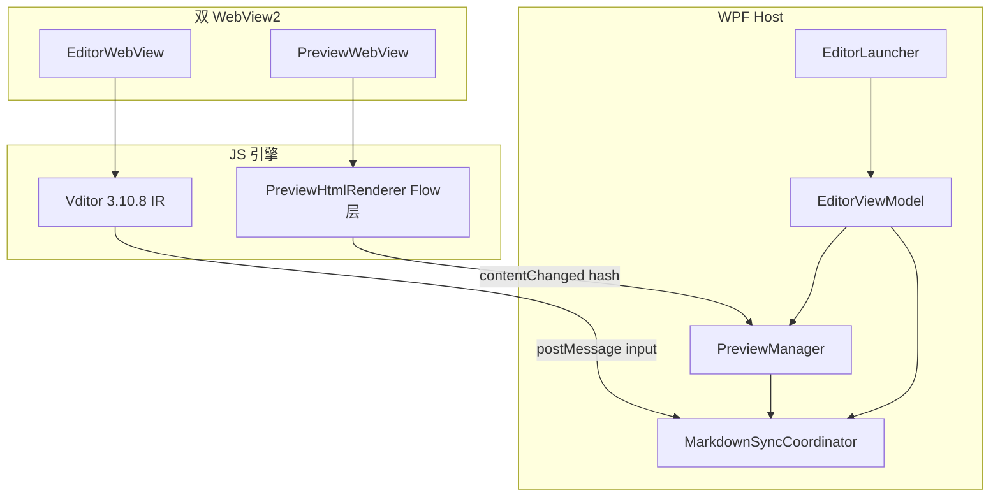
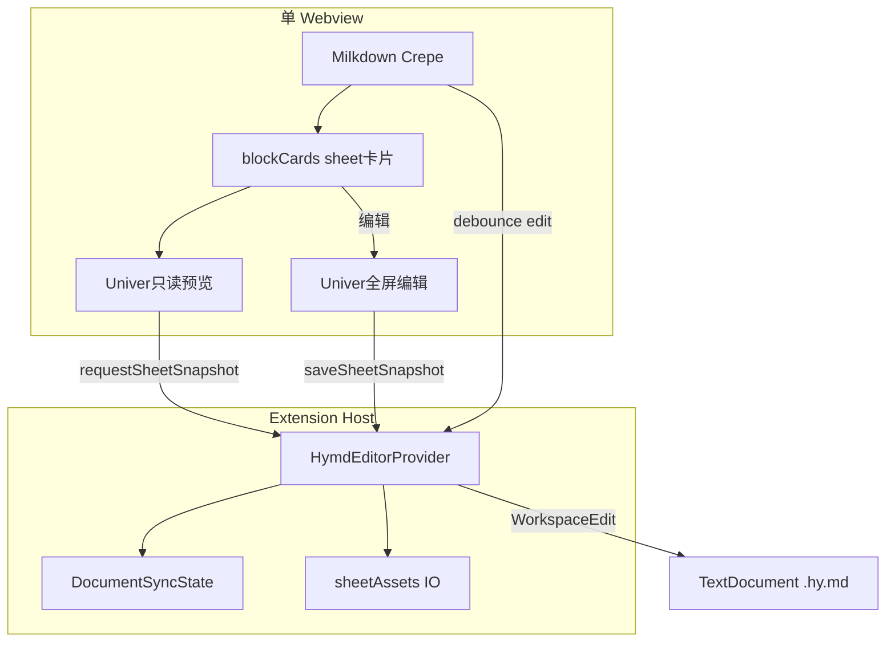

# 02 — WYSIWYG 实现对比：MarkdownEditor vs HYmd

> 调研日期：2026-07-03  
> 方法论：套用 [software-product-discovery](../../hy-cad-tool/.cursor/skills/software-product-discovery/SKILL.md) **阶段 2 五维打分** + **阶段 4 实现路径建议**；对象为两套**内部实现**互比，不做外部竞品联网搜索。  
> 关联：[01-当前完成内容与测试指南.md](01-当前完成内容与测试指南.md)

---

## 0. 对比目标与范围

| 项 | 说明 |
|---|---|
| 核心问题 | 两套 WYSIWYG 各用什么架构？优劣在哪？未来该往哪投？ |
| 对比对象 A | `hy-cad-tool/src/HyCADTool.MarkdownEditor` — AutoCAD 插件内的 Markdown 编辑 + 图纸预览 |
| 对比对象 B | `HYmd/packages/hymd-vscode` + `hymd-blocks-sheet` — VS Code/Cursor 扩展内的 HyMD WYSIWYG |
| 不在范围 | 外部产品（Typora、Obsidian、Notion）对比；完整 CAD 插入链路细节 |

**五维权重**（工具/编辑器类，合计 100%）：

| 维度 | 权重 |
|---|---|
| 功能 | 25% |
| 易用 | 25% |
| 可靠安全（数据不丢） | 20% |
| 稳定 | 15% |
| 差异化 | 15% |

---

## 1. 两实现概览

### 1.1 HyCADTool.MarkdownEditor

**定位**：被主插件反射调用的 **WPF + 双 WebView2** 窗口；左侧 Vditor IR 编辑，右侧自研 **Flow 图纸预览**（多栏分页、纸张模拟、CAD 参数映射）；输出 JSON 回 AutoCAD。

**架构**：



**关键文件**：

- `Html/VditorHtmlTemplate.cs` — Vditor IR 模板（zh_CN、明暗主题、快捷键拦截）
- `Html/PreviewHtmlRenderer.cs` — Markdig → HTML + 分栏分页 + contenteditable 逆转换
- `Services/MarkdownSyncCoordinator.cs` — 内容归属权（Editor/Preview）、回声过滤
- `Doc/043`、`Doc/056` — 架构总览与双解析器对比（本仓库已有深度分析）

### 1.2 HYmd（hymd-vscode）

**定位**：VS Code **CustomTextEditorProvider**；单 Webview 内 **Milkdown Crepe** WYSIWYG；**Markdown 文本为唯一真相源**；`sheet` 块用 Univer 只读预览 + 全屏覆盖层编辑。

**架构**：



**关键文件**：

- `packages/hymd-vscode/src/editorProvider.ts` — 宿主编排、整文档替换写回
- `packages/hymd-vscode/src/sync/documentSync.ts` — 版本号 + pendingHost 回声抑制
- `packages/hymd-vscode/src-webview/syncController.ts` — 220ms debounce、IME composition、overlay 暂停同步
- `packages/hymd-blocks-sheet` — Univer preset 封装
- `packages/hymd-parser` — parse/serialize、sheet 块 embed/export

---

## 2. 技术栈与架构对照表

| 维度 | MarkdownEditor | HYmd |
|---|---|---|
| **宿主** | .NET 8 WPF（AutoCAD 进程内） | VS Code Extension Host（Node/CJS） |
| **Web 容器** | 双 WebView2 | 单 Webview（iframe 沙箱） |
| **编辑内核** | Vditor 3.10.8 **IR 模式** | Milkdown **Crepe**（ProseMirror 系） |
| **Markdown 解析** | 编辑：Lute(Go→JS)；预览：Markdig C# | remark + unified（`@hymd/parser`） |
| **真相源** | ViewModel.MarkdownText（C# 字符串） | `TextDocument` 磁盘文本（`.hy.md`） |
| **WYSIWYG 策略** | IR：编辑区即渲染；图纸区：HTML contenteditable | Crepe：整篇 WYSIWYG；块区：fenced code 卡片 + Univer |
| **双向同步** | Coordinator 归属权 + PreviewManager hash/version | 版本号 + pendingHost + 220ms debounce |
| **IME 中文** | Vditor 内置 + WPF PreviewKeyDown 协同 | `compositionstart/end` 缓冲 externalUpdate |
| **扩展能力** | 图纸 Flow：A0–A4、多栏、边距拖拽、CAD 统计 | HyMD 块：sheet(Univer)、slide/layout/calc 占位 |
| **表格** | Vditor 原生 GFM 表 + 图纸区 Markdig 表 | Milkdown 表 + **sheet 块**（Univer 重表格/公式） |
| **公式** | KaTeX（Vditor 侧）；图纸侧无 | Crepe 默认关闭 latex；sheet 内 Univer 公式 |
| **构建** | MSBuild + 本地 Vditor 缓存/CDN | esbuild bundle（parser 打进 extension.js，Univer 进 webview.js ~22MB） |
| **代码量级** | PreviewHtmlRenderer ~4668 行（C#+CSS+JS） | hymd-vscode + blocks-sheet 数千行 TS（分散多包） |

---

## 3. 五维优缺点与打分

### 3.1 MarkdownEditor

| 维度 | 优点 | 缺点 | 得分 |
|---|---|---|---|
| **功能** | Vditor 生态成熟（高亮/KaTeX/上传）；图纸 Flow 独有（分页/纸张/CAD 映射） | 双解析器；图纸区逆转换有损；无 HyMD 式可拔插块 | **4/5** |
| **易用** | Typora 风格 IR；中英文工具栏；大纲双面板联动 | 双 WebView 学习成本高；图纸 editable 光标易丢 | **3/5** |
| **可靠安全** | C# ViewModel 集中状态；Coordinator 归属权防互抢 | 图纸 `blockToMarkdown` 有损（代码块语言、嵌套列表等） | **3/5** |
| **稳定** | 生产 AutoCAD 联调验证 | 双 WebView 内存；Preview 重建 DOM 时 Undo 丢失 | **3/5** |
| **差异化** | **CAD 图纸模式**护城河强 | 与通用 Markdown 工具链耦合弱 | **5/5** |

### 3.2 HYmd

| 维度 | 优点 | 缺点 | 得分 |
|---|---|---|---|
| **功能** | 文本+块分离；Univer sheet 公式往返；embed/export；任意 MD 工具可降级 | layout/slide 未交互；Milkdown 功能少于 Vditor；无图纸分页 | **3/5** |
| **易用** | 单编辑器面板；F5 即测；sheet「编辑」覆盖层清晰 | Univer 懒加载可能空白；Milkdown 与块卡片 DOM 嵌套复杂 | **4/5** |
| **可靠安全** | **Markdown 文本真相源**；parse→serialize 往返测试；公式写 assets JSON | 整文档 replace（M0）；大文件性能待优化 | **4/5** |
| **稳定** | Extension Host 隔离；overlay 时暂停 sync | webview.js 22MB；Milkdown 重渲染需幂等重挂 Univer | **3/5** |
| **差异化** | HyMD 超集+降级；可拔插引擎；HYmd Code 路线 | 尚无 CAD/纸张级排版 | **4/5** |

### 3.3 汇总对比

| 实现 | 功能 | 易用 | 可靠安全 | 稳定 | 差异化 | 加权总分 |
|---|---|---|---|---|---|---|
| **MarkdownEditor** | 4 | 3 | 3 | 3 | 5 | **3.55** |
| **HYmd** | 3 | 4 | 4 | 3 | 4 | **3.65** |

> 加权 = 功能×25% + 易用×25% + 可靠×20% + 稳定×15% + 差异化×15%

**行业现状小结（就这两套而言）**：

- **普遍做得好**：都用 Web 技术做 WYSIWYG；都意识到双向同步回声问题。
- **普遍短板**：在「富排版/表格/公式」与「纯 Markdown 可迁移」之间取舍不同；图纸 editable 逆转换 vs 块外置 snapshot 各有一坑。

---

## 4. 关键机制深挖

### 4.1 双向同步与回声抑制

| | MarkdownEditor | HYmd |
|---|---|---|
| **机制** | `ContentOwner`（CSharp / Preview）；`_isUpdatingFromPreview` + 文本哈希；Preview `version/hash` | `DocumentSyncState.pendingHostVersion`；webview `version` 单调递增 |
| **防抖** | PreviewManager 刷新链；Live Sync 防抖（CAD 侧） | 220ms debounce；overlay 打开时暂停 edit/external |
| **IME** | Vditor 内部 + WPF 路由 | 显式 `compositionstart/end` → buffer externalUpdate |
| **评价** | 双通道归属权清晰，但两 WebView 状态难统一 | 单通道版本机简单；overlay/IME 边界已专门处理 |

MarkdownEditor 摘录（归属权）：

```csharp
// MarkdownSyncCoordinator.cs
if (_contentOwner != ContentOwner.CSharp)
    return EditorInputSyncResult.Ignored;
```

HYmd 摘录（pending 期间忽略 external）：

```typescript
// documentSync.ts
shouldApplyExternal(content, documentVersion) {
  if (this.pendingHostVersion !== 0) return false;
  ...
}
```

### 4.2 Markdown 真相源策略（核心分歧）

| 策略 | MarkdownEditor | HYmd |
|---|---|---|
| **编辑面板** | Vditor IR → `getValue()` 得 Markdown | Milkdown → `markdownUpdated` 得 Markdown |
| **第二面板** | 图纸 HTML contenteditable → **手写 blockToMarkdown**（有损） | 无第二 Markdown 通道；sheet 走 **JSON snapshot** |
| **风险** | 图纸侧编辑可能丢语法 | fenced 块在 Milkdown 中仍是 code fence，块内 JSON 与 prose 分离 |

**结论**：HYmd 的「扩展块不逆转换 HTML，走独立 snapshot」比 MarkdownEditor 图纸区的 HTML→MD **更可靠**；MarkdownEditor 已在 Doc/056 建议「图纸保留布局 JS、CSS 对齐 Vditor」，与 HYmd 思路一致。

### 4.3 扩展块 / 富内容承载

| | MarkdownEditor | HYmd |
|---|---|---|
| **表格** | GFM 表（Vditor/Markdig） | GFM 轻量表 + **sheet 块**（Univer） |
| **公式** | KaTeX inline（Vditor） | Univer 单元格 `f` 字段 |
| **排版** | Flow 图纸引擎（mm/px、分栏） | `layout` 块占位（M1 未交互） |
| **降级** | 无统一块协议 | 任意 MD 渲染器见 code fence |

### 4.4 编辑内核选型

| 内核 | 模式 | 适用 |
|---|---|---|
| **Vditor IR** | Markdown AST 层操作，成熟工具栏 | 通用技术文档、工程说明 |
| **Milkdown Crepe** | ProseMirror WYSIWYG，可扩展 | IDE 内嵌、与 VS Code 文档模型对齐 |
| **PreviewHtmlRenderer** | 自研 layout + contenteditable | 仅当需要固定纸张/多栏/CAD 映射 |
| **Univer** | 电子表格引擎 | 计算表、荷载表等 sheet 块 |

Doc/056 已指出：**Vditor 不擅长分栏分页；PreviewHtmlRenderer 不擅长渲染质量** — 与 HYmd 把 Univer 限死在 `sheet` 块、正文用 Milkdown 是同一「职责分离」原则。

---

## 5. 结论与融合建议

### 5.1 一句话定位

| 项目 | 一句话 |
|---|---|
| **MarkdownEditor** | 为 **AutoCAD 工程图纸排版** 服务的双面板 Markdown 工作台（Vditor 质量 + 自研 Flow 图纸）。 |
| **HYmd** | 为 **HyMD 超集文档** 服务的 IDE 内 WYSIWYG（文本真相源 + 可拔插 Univer sheet 块）。 |

二者 **不是替代关系**，是 **场景不同** 的两条 WYSIWYG 路线。

### 5.2 互相借鉴

| 方向 | 建议 |
|---|---|
| **HYmd ← MarkdownEditor** | `layout` 块 M2+ 可参考 Flow 的 **mm 纸张、分栏、边距**；工程报告 theme 可对齐 `charWidthPx/fontWidthFactor` 思路 |
| **MarkdownEditor ← HYmd** | 图纸区 **不要用 contenteditable 逆转换** 承载重表格/公式；改为 fenced `sheet` + 外置 snapshot；正文继续 Vditor |
| **MarkdownEditor ← HYmd** | 引入 **parse→serialize 往返测试** 与块注册表，减少 Markdig/HTML 双轨语义漂移 |
| **HYmd ← MarkdownEditor** | Vditor 的 **content-theme / highlight.js** 可提升 Milkdown 代码块观感（Crepe 已部分具备） |
| **共同** | 同步层统一抽象：`ContentOwner` ≈ `pendingHostVersion`；IME 与 overlay/modal 打开时 **暂停双向 sync** |

### 5.3 实现路径建议（skill 阶段 4 精简版）

| 场景 | 推荐 |
|---|---|
| CAD 内嵌编辑 + 定稿图纸 | 继续 **MarkdownEditor** 路线；图纸 Flow 保留，渲染 CSS 对齐 Vditor（Doc/056 S1–S3） |
| 独立 HyMD 文档 / HYmd Code | 继续 **HYmd** 路线；M2 slide(Marp)、layout 交互 |
| 未来统一 | **不合并代码库**；共享 `@hymd/parser` 规范 + sheet snapshot 格式；CAD 侧消费 `.hy.md` + assets |

### 5.4 风险

| 风险 | 影响 | 对策 |
|---|---|---|
| MarkdownEditor 图纸逆转换有损 | 用户丢语法 | sheet/公式迁 HyMD 块；图纸只排版 prose |
| HYmd 整文档 replace | 大文件卡顿 | 增量 diff（M2+） |
| 双 WebView / 22MB webview | 内存 | 懒挂载 Univer；CAD 侧避免第三 WebView |
| 两套编辑器维护成本 | 人力 | 规范与 snapshot 共享，UI 各管各场景 |

---

## 6. 如何验证本对比（测试指针）

| 项目 | 怎么测 |
|---|---|
| MarkdownEditor | 打开 AutoCAD → HY 命令打开编辑器 → 编辑/图纸双面板联动；见 `RegressionSamples/` |
| HYmd | HYmd 仓库 F5 → `samples/02-report-with-sheet.hy.md`；见 [01-当前完成内容与测试指南.md](01-当前完成内容与测试指南.md) |
| 对比关注点 | 中文 IME、表格/公式编辑、保存后再打开是否丢数据、扩展块降级 |

---

## 7. 参考文档索引

| 文档 | 路径 |
|---|---|
| MarkdownEditor 架构 L1 | `hy-cad-tool/.../Doc/043-MarkdownEditor当前架构总览-L1-*.md` |
| 双解析器对比 L3 | `hy-cad-tool/.../Doc/056-双解析器优劣对比-L3-*.md` |
| HYmd 测试指南 | [01-当前完成内容与测试指南.md](01-当前完成内容与测试指南.md) |
| HyMD 格式规范 | `HYmd/spec/hymd-spec-v0.1.md` |
| 产品调研 skill | `hy-cad-tool/.cursor/skills/software-product-discovery/SKILL.md` |
