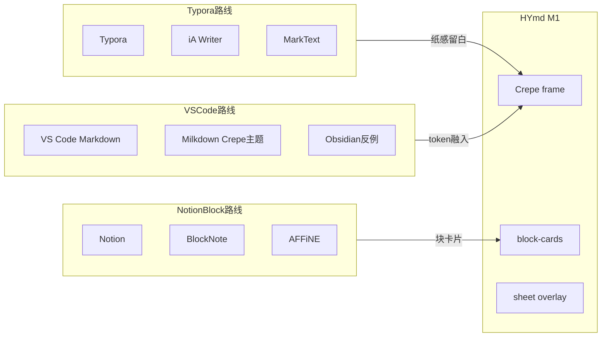

# 05 — HYmd 清爽 UI 方向对比与选型

> 调研日期：2026-07-03  
> 方法论：[software-product-discovery](../../hy-cad-tool/.cursor/skills/software-product-discovery/SKILL.md) 阶段 0–4（**UI/UX 专项**）；阶段 1 含联网竞品搜索。  
> 范围：**皮肤与块 UI**，不换 [03](03-为何使用Milkdown而非Vditor-2026-07-03-164000.md) 已锁定的 Milkdown Crepe 内核。  
> 关联：[001-产品调研](../Doc/001-md风格增强文档套件-产品调研-2026-07-03-102959.md)（简洁原则）· [04-零基础](04-零基础概念地图与03白话版-2026-07-03-165500.md)

---

## 0. 目标与「清爽」定义

### 0.1 目标陈述

为 **在 HYmd Code / VS Code 中编辑 `.hy.md` 的工程师**，提供 **低干扰写作 + 结构化扩展块可辨但不花哨** 的 WYSIWYG 界面；明暗主题与 IDE 一致，正文仍遵守「零内联样式、frontmatter 声明主题」([001](../Doc/001-md风格增强文档套件-产品调研-2026-07-03-102959.md))。

用户确认：**Typora 极简 / Notion 块结构化 / VS Code 原生融入** 三种路线都要对比，最终取 **组合（blend）**。

### 0.2 UI 三层范围

| 层 | 用户看到什么 | 当前实现 |
|---|---|---|
| **L1 Prose** | 标题、段落、列表的 WYSIWYG 区 | Milkdown Crepe + `frame.css` + 常驻 toolbar |
| **L2 块卡片** | `sheet` / `slide` 等扩展块的预览与入口 | `blockCards.ts` + `block-cards.css`（多色边框） |
| **L3 Sheet Overlay** | 全屏表格编辑 | `sheetOverlay.ts` + 顶栏 Save/Cancel |

CAD/WPF 宿主 UI 不在 M2 范围；仅作远期参考。

### 0.3 成功标准（目视验收）

- 写作时 **无「框中框」顶栏感**，接近 Typora 纸面留白
- 扩展块 **一眼可辨类型**，但不用红绿紫多条色带
- 切换 VS Code 明暗主题后，prose 与块区 **无明显色温跳变**
- Sheet 预览区与正文 **同一背景**，不出现「补丁贴上去」感

### 0.4 五维权重（UI 专项，合计 100%）

| 维度 | 权重 | 评估什么 |
|---|---|---|
| 功能（UI 能力） | 15% | 工具栏、块编辑入口、表格操作是否够用 |
| **易用 / 清爽感** | **35%** | 信息密度、干扰项、留白、中文输入 |
| 可靠（视觉不混淆） | 10% | 块边界清晰、预览/编辑态可区分 |
| 稳定（主题/性能） | 15% | 明暗切换、Univer 嵌入不闪、高对比度 |
| 差异化（HyMD 块） | 25% | sheet 块可识别、降级仍可读 |

---

## 1. 竞品与参考 UI 清单（联网）

### 1.1 三类参考谱系



### 1.2 竞品表

| 名称 | 形态 | 平台 | 价格 | 开源 | 活跃度 | 链接 | 一句话（UI） |
|---|---|---|---|---|---|---|---|
| **Typora** | 桌面 WYSIWYG | Win/Mac/Linux | ~$15 买断 | 否 | 活跃 | [typora.io](https://typora.io) | 无分屏、无粗 toolbar，语法随打随隐，清爽标杆 |
| **iA Writer** | 桌面写作 | Mac/Win/iOS | Mac $49.99 买断 | 否 | 活跃（v7.3, 2026） | [ia.net/writer](https://ia.net/writer) | 更大留白 + Focus 模式，比 Typora 更「空」 |
| **Mark Text** | 桌面 WYSIWYG | Win/Mac/Linux | 免费 | MIT | 维护中（GitHub 57k+ stars） | [marktext.app](https://marktext.app) | 免费 Typora 替代，Material 主题，界面简单 |
| **Notion** | SaaS 块编辑 | Web/桌面 | 免费档 + 付费 | 否 | 活跃 | [notion.so](https://notion.so) | 块 hover 手柄 + slash，信息结构化但 chrome 多 |
| **BlockNote** | React 库 | Web | 免费 / Pro | MPL-2.0 | 活跃（npm 0.51, 2026-05） | [blocknotejs.org](https://www.blocknotejs.org) | Notion 风块 UI 开箱即用，可接 Mantine/shadcn |
| **AFFiNE** | 开源知识库 | Web/桌面 | 免费 / 商业 | MIT | 活跃 | [affine.pro](https://affine.pro) | BlockSuite 块编辑 + 白板，UI 现代但较重 |
| **VS Code Markdown** | IDE 内置 | 全平台 | 免费 | MIT | 活跃 | [code.visualstudio.com](https://code.visualstudio.com) | 分屏预览或纯源码，chrome 最少、完全融入 IDE |
| **Obsidian** | 笔记 + 插件 | 桌面 | 免费 / Sync 付费 | 否 | 活跃 | [obsidian.md](https://obsidian.md) | 默认可不 WYSIWYG；插件多后 UI 易「拼装感」——作反例 |
| **Sheet Plus** | Obsidian 插件 | 桌面 | 基础免费 / 高级付费 | 插件闭源 | 活跃（v2.12, 2026-06） | [GitHub](https://github.com/ljcoder2015/obsidian-sheet-plus) | **Univer 嵌 md** 邻域参考：嵌入块 + 全功能表格 UI |
| **Milkdown Crepe** | 编辑器框架 | Web | 免费 | MIT | 活跃 | [milkdown.dev](https://milkdown.dev) | 内置 crepe/nord/frame 主题 + `--crepe-*` 变量 |

**归类**：Typora/iA/MarkText = **极简写作参考**；Notion/BlockNote/AFFiNE = **块 UI 参考**；VS Code/Obsidian = **宿主融入参考**；Sheet Plus = **HyMD sheet 块对标**；Crepe = **当前内核的皮肤来源**。

### 1.3 行业现状小结（UI 向）

**普遍做得好**：

- Typora 系：**单栏、无预览切换、 typography 克制**
- Notion 系：**块级语义清晰、操作入口统一（slash / 拖拽）**
- IDE 系：**CSS 变量跟宿主主题、无第二套配色**

**普遍痛点**：

- WYSIWYG 编辑器自带 **frame/toolbar** 与 IDE 叠两层 chrome
- 块编辑器 **多色标签** 在长文档里视觉噪音大
- **Univer 等嵌入引擎** 自带主题，与外层 WYSIWYG 背景不一致（Sheet Plus 社区亦报 styling issues）
- Milkdown Crepe **明暗主题动态切换** 文档不足（[issue #1839](https://github.com/Milkdown/milkdown/issues/1839)）

---

## 2. 三类参考路线 × 五维打分

> 分数 1–5；加权 = Σ(得分 × 权重)。

### 2.1 Typora 路线（极简 prose）

| 维度 | 优点 | 缺点 | 得分 |
|---|---|---|---|
| 功能 | 写作/导出够用 | 无 HyMD 块、无 IDE 集成 | 3 |
| 清爽感 | 干扰极少、留白大 | 块/表格弱 | **5** |
| 可靠 | 纯 md 文件 | 无块 snapshot 概念 | 4 |
| 稳定 | 成熟桌面应用 | 非 VS Code 宿主 | 4 |
| 差异化 | 写作体验 USP | 与 HyMD 块生态无关 | 3 |

**加权：3.95**

### 2.2 Notion-Block 路线（结构化块 UI）

| 维度 | 优点 | 缺点 | 得分 |
|---|---|---|---|
| 功能 | 块类型丰富、表格强 | 非纯 md Portable | 5 |
| 清爽感 | 现代、统一组件 | hover 手柄/slash 仍占视觉 | 4 |
| 可靠 | 块边界明确 | 数据模型复杂 | 4 |
| 稳定 | 大产品验证 | 嵌入 Univer 仍重 | 3 |
| 差异化 | 块生态 USP | 与 HyMD fenced 降级路线不同 | 5 |

**加权：4.25**

### 2.3 VS Code 原生路线（宿主融入）

| 维度 | 优点 | 缺点 | 得分 |
|---|---|---|---|
| 功能 | Git/命令/多文件 | 默认非 WYSIWYG | 3 |
| 清爽感 | 无多余装饰 | 分屏预览才「像文档」 | 4 |
| 可靠 | 文本即文件 | WYSIWYG 需扩展 | 5 |
| 稳定 | 与 IDE 同生命周期 | Webview 第二进程 | 5 |
| 差异化 | 开发者工作流 | 写作体验弱于 Typora | 3 |

**加权：3.85**

### 2.4 汇总对比

| 路线 | 功能 | 清爽 | 可靠 | 稳定 | 差异化 | 加权 |
|---|---|---|---|---|---|---|
| Typora 极简 | 3 | 5 | 4 | 4 | 3 | **3.95** |
| Notion-Block | 5 | 4 | 4 | 3 | 5 | **4.25** |
| VS Code 原生 | 3 | 4 | 5 | 5 | 3 | **3.85** |
| **HYmd M1 现状** | 3 | **2.5** | 4 | 3 | 4 | **3.18** |

> HYmd M1 清爽感偏低主因：Crepe **frame** 边框感 + 块卡片 **多色 left-bar** + toolbar 常驻。

---

## 3. 当前 M1 实现基线（读码）

| 区域 | 文件 | 现状 | 与「清爽」差距 |
|---|---|---|---|
| Prose 主题 | `src-webview/index.ts` | `frame.css` + `toolbar: true` | Frame 带顶栏/框线，非纸感 |
| Prose 留白 | `media/editor.css` | `padding: 24px 32px` | 尚可；未限制最大行宽（Typora 常限 ~800px） |
| VS Code token | `editor.css` | `--vscode-editor-background/foreground` | 仅 body；Crepe 内部仍用 `--crepe-*` 默认色 |
| 主题切换 | `editorProvider.ts` → `themeChanged` | 只改 `body[data-theme]` 与 `--hymd-accent` | **未**切换 crepe-light/dark stylesheet |
| 块卡片 | `block-cards.css` | 4 色左边框 + 大写 badge + 绿按钮 | 调试风、饱和度高 |
| Sheet 预览 | `block-cards.css` | 绿边框 preview host | 与 prose 背景割裂 |
| Overlay | `sheetOverlay.ts` | 绿 tint 顶栏 | 可用；宜改为 `--vscode-*` 按钮 |

---

## 4. 专题：四层各自如何「做清爽」

### 4.1 L1 Prose — 借 Typora

| 做法 | 说明 |
|---|---|
| 换 Crepe 皮肤 | `nord.css` / `crepe.css` 比 `frame.css` 更 flat；或 frame 但隐藏外框 |
| 隐藏/悬停 toolbar | Crepe `features.toolbar: false` 或 CSS 默认 `opacity:0`，focus 时显示 |
| 限宽居中 | `.ProseMirror { max-width: 720–800px; margin: 0 auto; }` |
| 映射 token | `.milkdown { --crepe-color-background: var(--vscode-editor-background); ... }` |

### 4.2 L2 块卡片 — 借 Notion（低饱和版）

| 做法 | 说明 |
|---|---|
| 单色边框 | 统一 `1px solid var(--vscode-panel-border)`，去掉 `#22c55e` 等 left-bar |
| 小标签 | badge 改为 12px 常规大小写「表格 · load-table」，不用全大写 |
| 预览区 | 去掉绿色 border；`min-height` 保留，背景 = editor background |
| 操作 | 「编辑」改为 text button / link 风格，非实心绿框 |

参考 Sheet Plus：**嵌入块与正文同宽、表格占卡片主体**；HyMD M1 已有结构，只差视觉降噪。

### 4.3 L3 Overlay — 借 VS Code

| 做法 | 说明 |
|---|---|
| 顶栏 | 背景 `var(--vscode-titleBar-activeBackground)` 或 editor background |
| 按钮 | Primary = `--vscode-button-background`；Cancel = secondary |
| 去掉绿色 tint | 全 overlay 只用 VS Code token + 一条底部分隔线 |

### 4.4 主题同步 — 三路交界

Milkdown 官方建议（[#1839](https://github.com/Milkdown/milkdown/issues/1839)）：

- **Approach 1**：复制 `--crepe-*` 到 `.dark .crepe .milkdown { ... }`，与 VS Code 变量对齐
- **Approach 2**：`<link id="crepe-light">` / `<link id="crepe-dark">` 动态 `disabled` 切换

HYmd 已在 host 侧监听 `onDidChangeActiveColorTheme`，M2 应在 webview 收到 `themeChanged` 时 **同步 Crepe 变量或 stylesheet**。

---

## 5. HYmd 推荐 UI v1（Blend）

### 5.1 一句话

> **Prose 走 Typora 纸感；块走 Notion 结构化但低饱和；chrome 走 VS Code token 融入。**

### 5.2 MoSCoW

| 优先级 | 项 |
|---|---|
| **Must** | Crepe 改 **nord/crepe** + `--crepe-*` → `--vscode-*` 映射；prose **限宽 + 悬停 toolbar** |
| **Must** | 块卡片 **单色细边框 + 小标签**；去掉多色 left-bar；sheet 预览区与正文同背景 |
| **Should** | `themeChanged` 动态切换 crepe light/dark（Approach 1 或 2） |
| **Should** | overlay 按钮改用 VS Code token |
| **Should** | frontmatter `theme: engineering-report` 映射 typography（M3 排版引擎，001 已预留） |
| **Won't (M2)** | 换 BlockNote 内核；Notion slash 菜单全量重做；Univer 完全自定义皮肤 |

### 5.3 三态 ASCII 线框

**态 1 — 正文编辑（Typora 纸感 + 低调块）**

```
┌──────────────────────────────────────────────────────────────┐
│  (无顶栏 / toolbar 悬停才出现)                                  │
│                                                              │
│          ┌──────────────────────────── max ~760px ─────────┐ │
│          │  # 设计说明                                        │ │
│          │  正文段落……                                       │ │
│          │  ┌─ 表格 · load-table ──────────── [编辑] ─┐    │ │
│          │  │  (Univer 预览，无绿框，与背景同色)          │    │ │
│          │  └──────────────────────────────────────────┘    │ │
│          │  ## 结论                                          │ │
│          └─────────────────────────────────────────────────┘ │
└──────────────────────────────────────────────────────────────┘
     ↑ 背景 = --vscode-editor-background
```

**态 2 — Sheet 块卡片（Notion 低饱和）**

```
┌─ 表格 · load-table ──────────────────────── 编辑 ─┐
│  ./xxx.hy.assets/load-table.univer.json (小字灰)   │
│  ┌─────────────────────────────────────────────┐  │
│  │         Univer 只读预览（无额外彩边）          │  │
│  └─────────────────────────────────────────────┘  │
└───────────────────────────────────────────────────┘
   1px 边框 = --vscode-widget-border，无 4px 色条
```

**态 3 — Sheet 全屏（VS Code 原生 chrome）**

```
┌──────────────────────────────────────────────────────────────┐
│  编辑表格 · load-table              [取消]  [保存并返回]       │  ← vscode 按钮色
├──────────────────────────────────────────────────────────────┤
│                                                              │
│                    Univer 全功能编辑区                          │
│                                                              │
└──────────────────────────────────────────────────────────────┘
```

---

## 6. 实现路径 A–D 对比

| 路径 | 做法 | 清爽度 | 工作量 | 风险 | 推荐 |
|---|---|---|---|---|---|
| **A** | 换 `nord.css`/`crepe.css` + 覆盖 `--crepe-*` | 高 | 1–2 天 | 字号部分硬编码 ([#2315](https://github.com/Milkdown/milkdown/issues/2315)) | **M2 首选** |
| **B** | 保留 `frame.css`，只改 `editor.css` + 简化 block-cards | 中 | 0.5–1 天 | Frame 框感仍在 | 最低成本 fallback |
| **C** | `toolbar: false` 或悬停显示 + 快捷键/ slash 保留 | 很高 | 1–2 天 | 新手发现性下降 | **与 A 并行** |
| **D** | `--hymd-block-*` 设计 token + Univer 背景跟 token | 高（块区） | 2–3 天 | Univer 22MB 样式难完全统一 | **M2 第二阶段** |

**推荐组合**：**A + C**（prose）→ **D 的 CSS 简化版**（块）→ overlay token 化（半日）。

### 6.1 关键改动文件（供后续 PR，本文不改代码）

| 文件 | 改动方向 |
|---|---|
| `packages/hymd-vscode/src-webview/index.ts` | theme import；`features.toolbar`；theme 切换 hook |
| `packages/hymd-vscode/media/editor.css` | max-width、Crepe 变量映射、toolbar 悬停 |
| `packages/hymd-vscode/media/block-cards.css` | 单色边框、`--hymd-block-*` |
| `packages/hymd-vscode/src/editorProvider.ts` | html 壳预留 theme link id |
| `packages/hymd-vscode/src-webview/blockCards.ts` | badge 文案大小写（可选） |

### 6.2 M2 UI 路线图（约 1–2 周）

| 阶段 | 交付 | 验收 |
|---|---|---|
| **M2-UI-1** | A+C：Crepe 皮肤 + token 映射 + 限宽 + toolbar 悬停 | 目视接近 Typora；明暗切换 prose 无明显跳色 |
| **M2-UI-2** | 块 CSS 简化（D 子集） | sheet 块无 multicolor bar；预览区与正文同色 |
| **M2-UI-3** | overlay VS Code 按钮 + themeChanged 同步 Crepe | F5 切换主题三次无残留亮/暗错配 |
| **M3** | frontmatter `theme` → typography / layout 预览 | 见 001 排版里程碑 |

---

## 7. 风险与对策

| 风险 | 影响 | 对策 |
|---|---|---|
| Crepe 动态换肤 | 明暗切换 half-light | Approach 1 变量表一次性对齐 VS Code token |
| Crepe 字号硬编码 | 工程报告字号不可调 | M2 用 CSS 覆盖 heading scale；M3 layout 引擎 |
| Univer 自带 UI 色 | sheet 预览「异色块」 | 预览 host 背景透明 + Univer darkMode 跟 host |
| 高对比度主题 | `--vscode-*` 与 Crepe 冲突 | 单独测 `High Contrast`；必要时第三套变量 |
| 隐藏 toolbar | 新用户找不到加粗/表 | 保留 slash/快捷键；01 文档补「悬停显示工具栏」 |

---

## 8. UI 验收清单

在 [01-测试指南](01-当前完成内容与测试指南.md) 自动化项之外，**F5 目视**：

| # | 项 | 通过标准 |
|---|---|---|
| U1 | Prose 留白 | 正文区有 max-width，两侧留白，非全宽贴边 |
| U2 | Toolbar | 默认不抢视线；选中文字或悬停编辑区可访问格式化 |
| U3 | 块卡片 | 无 4px 彩色 left-bar；类型标签可读但不 shout |
| U4 | Sheet 预览 | 预览区背景 = 编辑区背景；无独立绿框 |
| U5 | Overlay | 顶栏/按钮像 VS Code 原生，无大面积绿色 tint |
| U6 | 主题 | Light → Dark → Light 切换，prose + 块区同步 |
| U7 | 高对比度 | HYmd Code 高对比主题下文字可读、边框可见 |
| U8 | 降级 | 关闭 WYSIWYG，纯 md 预览仍正常（与 UI 无关但回归） |

---

## 9. 零基础附录（三个词）

| 词 | 白话 | 在清爽 UI 里指什么 |
|---|---|---|
| **Toolbar** | 加粗、标题那排按钮 | 常显 = 不清爽；Typora 几乎隐藏 |
| **Theme** | 明暗配色 | 应跟 VS Code 一套，不要编辑器再搞一套 |
| **Webview** | IDE 里嵌的「网页编辑区」 | 清爽 UI 主要改这里的 CSS |

详见 [04-零基础概念地图](04-零基础概念地图与03白话版-2026-07-03-165500.md)。

---

## 10. 参考

| 材料 | 路径 / 链接 |
|---|---|
| Crepe 主题 API | [milkdown crepe.md](https://github.com/Milkdown/milkdown/blob/master/docs/api/crepe.md) |
| Crepe 动态换肤 | [Milkdown #1839](https://github.com/Milkdown/milkdown/issues/1839) |
| 当前 Crepe 配置 | `packages/hymd-vscode/src-webview/index.ts` |
| 块卡片样式 | `packages/hymd-vscode/media/block-cards.css` |
| Sheet Plus（Univer 嵌入 UI） | [obsidian-sheet-plus](https://github.com/ljcoder2015/obsidian-sheet-plus) |
| Typora UI 评价 | [DEV 2025 Markdown editors](https://dev.to/_d7eb1c1703182e3ce1782/best-markdown-editors-for-developers-in-2025-desktop-web-and-cli-options-299f) |
